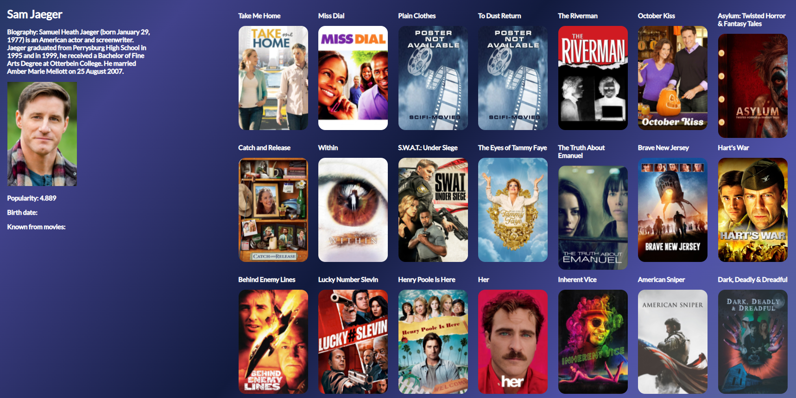

Movie Recommender is a web application built with django version 3.2.5, SQLLite.
API Source: https://www.themoviedb.org/
Functionalities:
    *  User Authorization
    *  Collecting User data about favourite movies, actors, genres
    *  Suggesting movies by favourite movies, ratings and genres
    *  Sample of forum message discussions, users can have about the movies
    *  Recommending movies by collaborative filtering
    *  Rating movies

 
